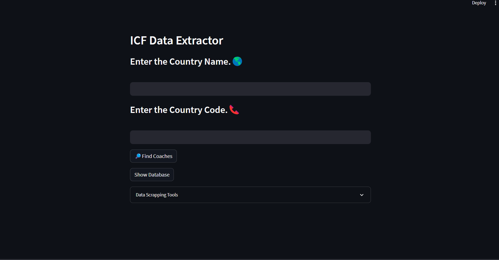
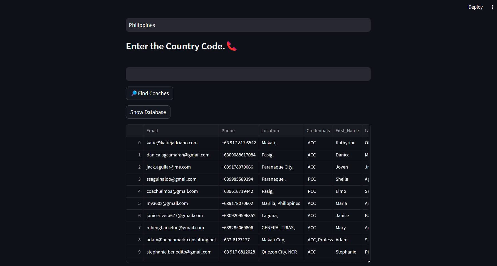
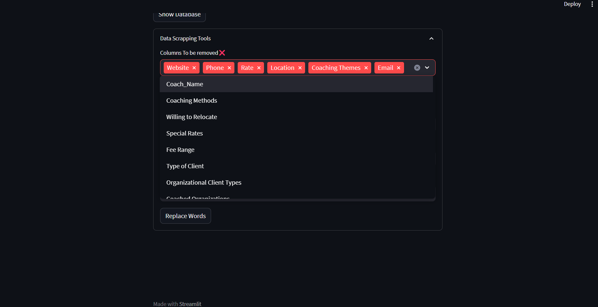
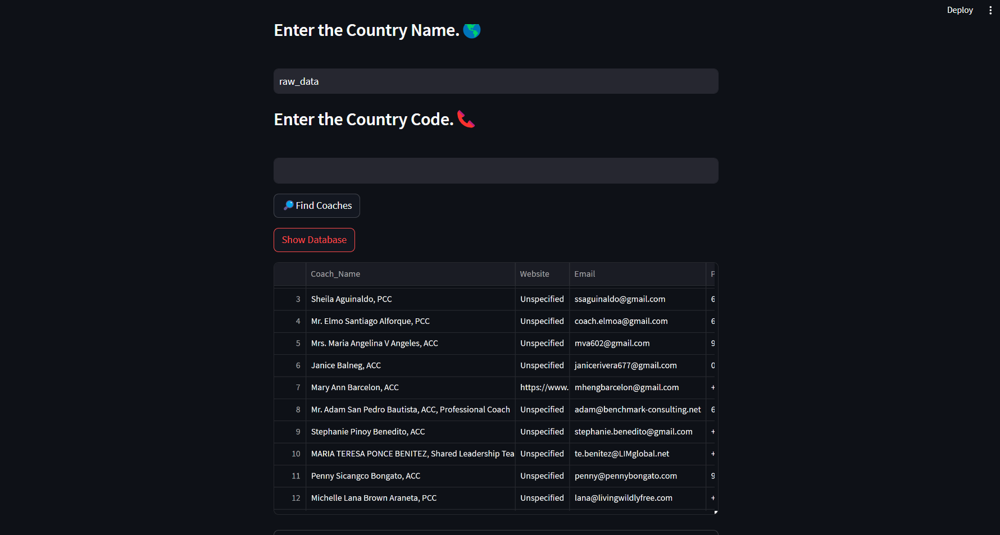

# ICF Data Extraction Code

 ## Steps to Run the Code

1. **Download the Repository:**
   - Download the repository to your local machine.

2. **Navigate to the Code Directory:**
   - Open the Terminal in the directory where you downloaded the code.

3. **Install Dependencies (First-time Installation Only):**
   - If this is your first time running the code, execute the following command in the terminal:
     ```bash
     pip install -r requirements.txt
     ```

4. **Run the Code:**
   - Once all dependencies are installed, run the following command in the terminal:
     ```bash
     streamlit run Main.py
     ```

5. **Access the Application:**
   - The application should start, and you can access it as directed.

Follow these steps for a smooth execution of the code.

## UI Navigation

1. **Initial Setup:**
   - Run the code, and two websites will open – one for automated Chrome and the other for the user interface. 
     (Note: Do not close the automated Chrome site.)

    <!-- Replace with the actual photo link -->

2. **Navigation Options:**
   - Upon opening the UI, you will find four navigation options:

   2.1. **Country Name:**
       - Enter the desired country name. Ensure accurate spelling matches the site.

   2.2. **Country Code:**
       - Enter the country code without the "+" sign.

   2.3. **Show Database:**
       - Provides a quick view of the created database simplistically.
        
   2.4. **Data Scraping Tools:**
       - Explore advanced tools to fine-tune your data.

Choose the appropriate option to navigate and interact with the application.


## Running the Code

1. **Find Coaches:**
   - Enter the country name and country code, then press "Find Coaches". Relax and wait for the scraper to do its work; the duration depends on the number of columns. Two CSV files will be created: one with raw metadata and another with some preprocessing already applied. View the database by clicking "Show Database".

      

2. **Advanced Tools:**
   - After data scraping, utilize the advanced tools:

     2.1. **Column Remover:**
         - Remove multiple columns in one click. Note that column values remain static, so even after removal, they will be visible in the selection. Confirm successful removal by checking the success message or clicking "Show Database".

         

     2.2. **Replace Tool:**
         - A powerful tool; use with caution as changes cannot be undone. It's recommended to make a copy of the CSV file at another location before using this tool. Provide the word you want to replace and the replacement (leave blank to remove). Ensure the correct column is selected for value removal.

         

Always exercise caution, especially when using advanced tools, and make backups to avoid unintentional data loss.


## Tips

**Quick Hack:**
If you make a mistake or need quick fixes, you can use the following hack:
- Enter the name of the CSV file you want to modify as the "Country Name".
- Utilize the data scraping tools for quick fixes and modifications.

This handy trick allows you to work directly on a specific CSV file without going through the entire process, providing a quick and efficient way to make adjustments.
 

# Author & Contributions
  - Varun Chindage
